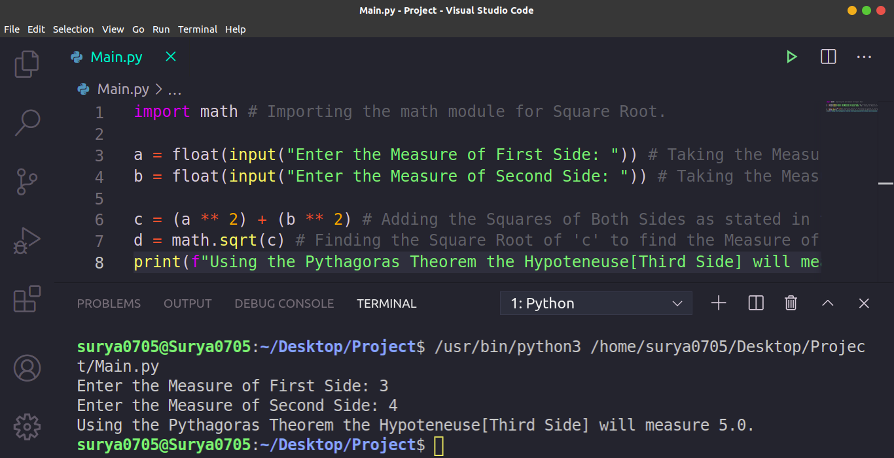

# Pythagoras_Theorem_in_Python
This is a Python Program that finds the Hypotenuse of any triangle if it is provided with both the two sides as Input. It uses some basic programming and the 'math' module for this purpose.
Below is the Screenshot of My Program:

Hope that you Liked it!
